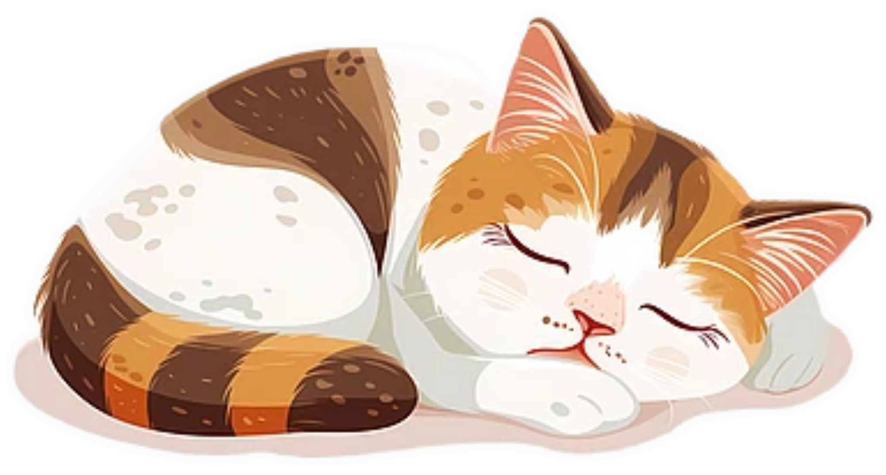

<head>
<meta charset="utf-8">
 <meta name="viewport" content="width=device-width, initial-scale=1.0">
<link href="https://fonts.googleapis.com/css2?family=Amatic+SC:wght@400;700&family=Lora:wght@400;700&display=swap" rel="stylesheet">
<link rel="icon" type="image/png" sizes="16x16" href="images/favicon1.ico">
<link rel="icon" type="image/png" sizes="32x32" href="images/favicon.ico">
<link rel="apple-touch-icon" sizes="180x180" href="images/favicon2.ico">
<meta name="description" content="I am a sensitive creature but I also don't give any Fuck!" />
<meta property="og:image" content="images/homecat.png">
<link rel="stylesheet" type="text/css" href="main.css" />
<title>
MOODY CATS
</title>
</head>
<body>
<h1> <a href="https://bamboodiaries.github.io">MOODY CATS</a></h1>

 To observe, judge and ignore! 

 
 

<ul>

<li>
<a href="#">Streets|</a> </li>

<li><a href="#">People|</a> </li>

<li> <a href="#">About|</a> </li>
</ul>

 

<h2 style="text-align:left;"> Recently on the streets: </h2>

 
Parkour Parkour of Ironies! 

<small> 2025-10-20 </small>

 

